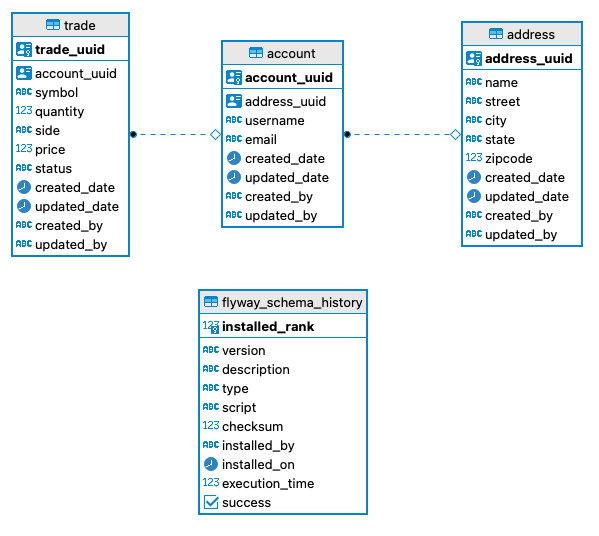

# General comments about the project

## Embedded Postgre SQL Database
Just a quick comment about this database, apparently there's an issue with it in OSX specially if you are using Big Sur.
In case you face the same issue you'll need to install postgres binaries:

```
brew install postgresql
```

You can find more information about the issue [here](https://github.com/opentable/otj-pg-embedded/issues/136).

## Bug fixes

In order to accomplish all the tasks I needed to fix a few things on the project:

1. Isolate the unit tests database: The application was using the same database for execution and unit tests which causes 
 issues when the development instance had some records that the unit tests were trying to insert leading to execution errors. 
   That's why I created a custom port for them.
   
2. Rollback all the updates done by unit tests: Since the tests were persisting the data into the test database the second 
time we ran some tests we had errors. So, I changed its configuration to rollback all changes on the database during tests.
   
## Improvements 

1. Validation: All the validations were being executed on the service layer (internally) and wrong input were being accepted by the
endpoints. The validation logic was also built in a non-declarative way and if we need to implement a most elaborated validation
we'd be limited. So I added some domain validation logic to the beans and added an ExceptionHandler to translate the exceptions in
bad request http status. By doing this I moved the tests cases related to bean validation to the controller unit tests.
   
2. Cohesion and Coherence: We had some repositories and services executing operations for multiple entities (account and address) 
which violates the SRP (Single Responsibility Principle) and also let our classes less cohesive and coherent. I split the logic 
related to each entity to a separate repository and service.
   
3. Enums: I also added some enums to automatically restrict the values accepted for some fields such State, TradeState and TradeSide.

4. Rest endpoints: 
   a. Sorry to make assumptions on the sample you provided me, but I think it'd be a great exercise to make this API
a bit more compliant to the Rest standards. So, I deducted that one account can only have one address and one address can be attached 
to only an account. So, I created  a separate controller to accommodate all the logic for this resource, which is a sub-resource of
accounts (/accounts/{accountUuid}/address).
   b. I also created all the endpoints to make this project a bit more closer to *production ready*.
   c. Please find the swagger-ui where you can play a bit with all the endpoints without needing to configure a rest client for it.  
      It's available on the [application root context](http://localhost:8080).
   
## Table Design

Please check the final version of the table design


## Final Considerations
First, thanks for the opportunity to work on this. This was my first experience using Spock to write unit tests, and 
I enjoyed a lot. Way less verbose than Junit and almost readable as cucumber but with less setup and effort. 
